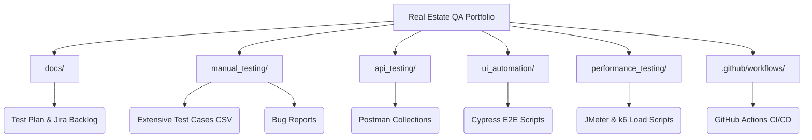

# PropTech QA Automation & Testing Portfolio

Welcome to my **Quality Assurance Portfolio**. This repository demonstrates a complete, industry-standard Software Testing Life Cycle (STLC) applied to a complex **Laravel Real Estate Listing Platform (PropTech)**. 

Unlike standard e-commerce, this project highlights testing for **Role-Based Access Control (RBAC)** (Admin, Agent, Buyer), complex **Polygon Map API Searches**, and **Property Approval Workflows**.

---

## 🏗️ Repository Architecture

---

## 🗂️ What's Inside?

### 1. 📄 Documentation (`/docs`)
- **PropTech Test Plan:** Formal IEEE 829 document outlining the scope, including Agent dashboards and map boundary filters.
- **Agile Backlog:** CSV export mapping Epic/User Story logic for property filtering and submissions.

### 2. 🕵️‍♂️ Manual Testing (`/manual_testing`)
- **Real Estate Test Cases:** Detailed scenarios validating Agent vs Buyer roles, Mortgage Calculator logic, and interactive map behaviors.
- **Bug Reports:** Detailed defect logging (e.g., AJAX failure on rapid map panning).

### 3. 🔌 API Testing (`/api_testing`)
- **Postman Collection & Environment:** Tests the backend endpoints for bounding box searches (`/api/properties/search`) and Agent Contact forms. 

### 4. 🤖 UI Automation (`/ui_automation`)
- **Cypress Framework:** Validates complex UI workflows.
  - `search.cy.js`: Automates testing of Price filters.
  - `agent_submit.cy.js`: Automates an Agent logging in and attempting to upload a property without images (Validating form blocks).

### 5. 🚀 Performance Testing (`/performance_testing`)
- **k6 Script:** PropTech searches are query-heavy due to geospatial bounding boxes. This script ensures the server can handle 200 concurrent users panning the map simultaneously.

### 6. ⚙️ CI/CD Integration (`/.github/workflows`)
- **GitHub Actions Pipeline:** Automatically runs API integration tests and UI checks on every deployment to prevent regressions in the property submission flow.
